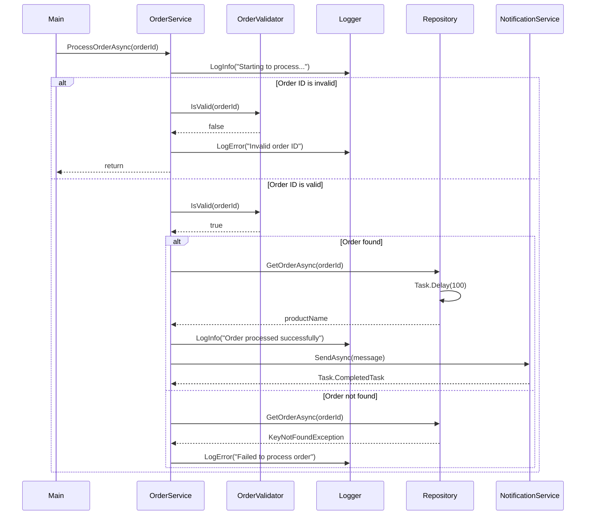

# Order Processing System

## Project Overview

This is a production-ready order processing system built with .NET 8. The application demonstrates modern software engineering practices including dependency injection, asynchronous programming, thread safety, and comprehensive error handling. The system processes orders in parallel, validates input, logs operations, and sends notifications - all while maintaining clean architecture principles.

The solution consists of two projects:
- **OrderPrecessing** - Main console application
- **OrderProcessing.Tests** - Unit test project using xUnit and Moq

## How to Run

### Prerequisites
- .NET 8.0 SDK or later

### Build the Solution
```bash
dotnet build
```

### Run the Application
```bash
dotnet run --project OrderPrecessing.csproj
```

### Run Tests
```bash
dotnet test
```

## Architecture Diagram



## List of Completed Bonus Tasks

### ✅ Core Requirements

**1. Asynchronous Processing**
- Converted `ProcessOrder` to `ProcessOrderAsync` returning `Task`
- Added `Task.Delay(100)` in repository to simulate real async work
- Implemented `await` and `Task.WhenAll` in Main for parallel execution
- All async operations properly awaited throughout the call chain

**2. Add Order (CRUD)**
- Added `AddOrderAsync(Order order)` method to `IOrderRepository`
- Implemented thread-safe insertion using `ConcurrentDictionary.TryAdd`
- Duplicate orders are rejected with `InvalidOperationException`
- Called from a separate `Task` in Main to demonstrate concurrent operations

**3. Thread-Safe In-Memory Repository**
- Used `ConcurrentDictionary<int, Order>` for thread-safe operations
- Pre-loaded two sample orders: ID 1 → "Laptop", ID 2 → "Phone"
- Proper exception handling:
  - `ArgumentException` thrown for `orderId <= 0`
  - `KeyNotFoundException` thrown when order not found
- All read/write operations are thread-safe

**4. OrderService Implementation**
- Injected `IOrderRepository` and `ILogger` via constructor (plus validator and notification service)
- In `ProcessOrderAsync`:
  - Logs the start of processing
  - Calls repository to fetch order
  - Logs success with product name
  - Catches and logs any exceptions that occur

**5. Dependency Injection Container**
- Created `ServiceContainer` class with `Build()` method
- All services registered as singletons
- All dependencies injected via constructor - no `new` keywords in service classes
- Clean separation of concerns with interface-based design

**6. Complete Main Method**
- Uses DI container to resolve services
- Runs 3 parallel tasks using `Task.WhenAll`:
  - Process order 1 (valid)
  - Process order 2 (valid)
  - Process invalid order (-1)
- Additional task for adding new order (ID 3, "Tablet")
- Logs final message: "All orders processed."

### ✅ Bonus Tasks

**3. IOrderValidator**
- Created `IOrderValidator` interface with `bool IsValid(int orderId)` method
- Implemented `OrderValidator` with simple positive ID validation
- Injected into `OrderService` and validates before repository call
- Prevents unnecessary repository access for invalid IDs

**4. Unit Tests**
- Added xUnit test project `OrderProcessing.Tests`
- Written 3 comprehensive tests:
  - **Happy Path**: Valid order ID processes successfully, calls repository and notification
  - **Invalid ID**: Invalid order ID doesn't call repository, logs error
  - **Not Found**: `KeyNotFoundException` is caught and logged properly
- All tests use Moq to mock `ILogger` and `IOrderRepository`
- Tests verify correct method calls and exception handling

**5. Configuration via appsettings.json**
- Added `appsettings.json` with `LogLevel` configuration
- `ConsoleLogger` reads configuration via `IConfiguration`
- When `LogLevel` is set to "Error", Info logs are skipped
- Configuration properly loaded in `ServiceContainer`

**6. Notification Service**
- Created `INotificationService` interface with `SendAsync(string message)` method
- Implemented `EmailNotificationService` that logs notifications to console
- Injected into `OrderService` and called after successful order processing
- Sends notification with order details (ID and product name)

## Key Features

- **Thread Safety**: All repository operations use `ConcurrentDictionary` for safe concurrent access
- **Error Handling**: Comprehensive exception handling with proper logging
- **Dependency Injection**: Clean architecture with all dependencies injected
- **Async/Await**: Full asynchronous support with proper `Task` usage
- **Configuration**: JSON-based configuration for log levels
- **Testing**: Complete unit test coverage with mocking
- **SOLID Principles**: Single responsibility, dependency inversion, and interface segregation

## Project Structure

```
OrderPrecessing/
├── Order.cs                      # Domain model
├── IOrderRepository.cs           # Repository interface
├── IOrderService.cs              # Service interface
├── ILogger.cs                    # Logger interface
├── IOrderValidator.cs            # Validator interface
├── INotificationService.cs      # Notification interface
├── InMemoryOrderRepository.cs   # Thread-safe repository implementation
├── OrderService.cs               # Business logic implementation
├── ConsoleLogger.cs              # Logger with appsettings.json support
├── OrderValidator.cs             # Input validation
├── EmailNotificationService.cs  # Notification implementation
├── ServiceContainer.cs           # DI configuration
├── Program.cs                    # Entry point with parallel processing
├── appsettings.json              # Configuration file
└── OrderProcessing.Tests/       # Unit test project
    └── OrderServiceTests.cs      # xUnit tests with Moq
```
